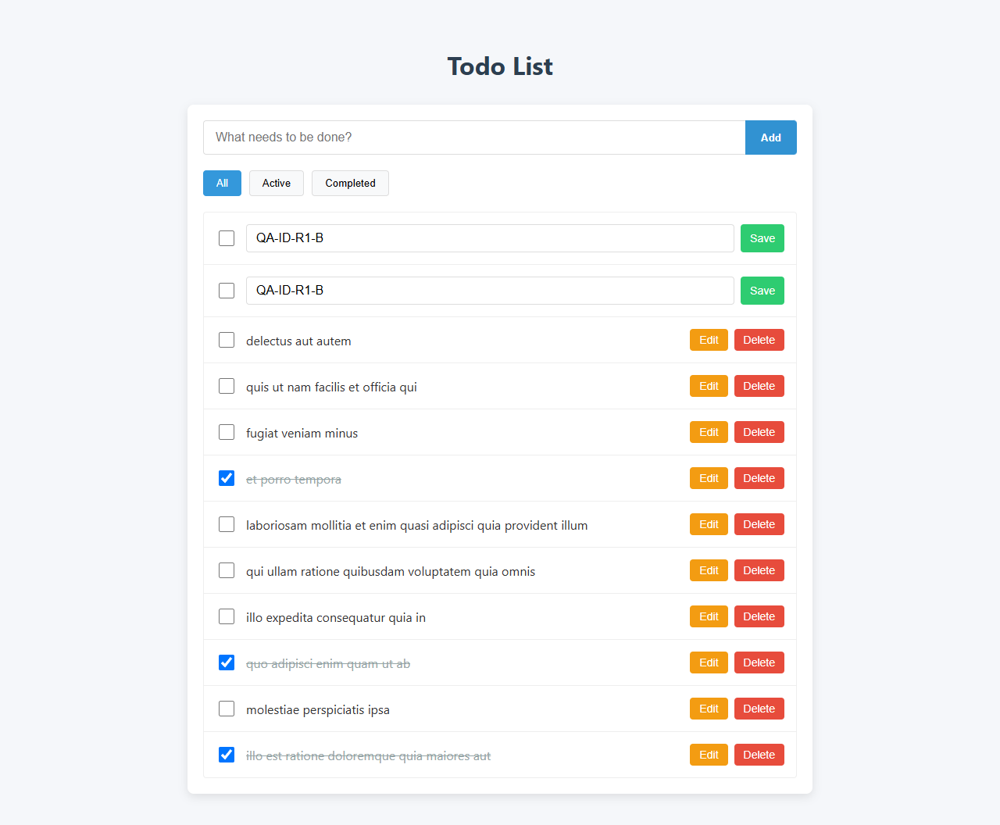

# Отчёт по тестированию `angular-todo-app`

**Роль:** Manual QA Engineer  
**Дата:** 31.08.2026  
**Решение:** **No-Go** до устранения трёх дефектов Major

## 1. Результат и окружение

Последовательный CRUD работает. При задержке API до 2 секунд приложение теряет последнее пользовательское состояние; повторяющийся ID новых задач нарушает адресность Edit/Delete. Подтверждены 3 дефекта Major: каждый воспроизведён 2/2 в Chrome и 1/1 в Edge. Сброс после F5 не считается дефектом: JSONPlaceholder не хранит изменения.

| Параметр | Значение |
|---|---|
| ОС / браузеры | Windows 11 Pro 64-bit build 26200; Chrome 152.0.7977.64; Edge 152.0.4191.53 |
| Node.js / npm / Angular | 24.14.0 / 11.9.0 / 16.2.12 |
| URL / API | `http://127.0.0.1:4200`; `https://jsonplaceholder.typicode.com/todos` |
| Архив, SHA-256 | `03DF42B0B24F4BFF3C40FD868459A967EB2507570159EF737B12E9AD05DCBD2C` |

| Этап | Чистое время |
|---|---:|
| Развёртывание и проверка окружения | 00:15 |
| Исследовательская сессия | 00:50 |
| Повторное воспроизведение и доказательства | 00:25 |
| Тест-дизайн: кейсы, пагинация, риски | 00:35 |
| Отчёт, PDF и итоговый аудит | 00:30 |
| **Всего** | **02:35** |

Учтено активное время полного цикла до финальной версии; паузы исключены. Исходный код приложения и API не изменялись.

## 2. Исследовательское тестирование

### Что проверено за 50 минут

| Время | Фокус | Результат |
|---|---|---|
| 10 мин | Загрузка, список, базовый CRUD, фильтры | Happy path пройден; Console: только `favicon.ico` 404 |
| 15 мин | Add/completion/фильтры, задержка до 2 с | Обнаружена потеря Add после позднего GET — BUG-001 |
| 15 мин | Edit/Delete, повторные действия, ответы не по порядку | Обнаружены откат Edit и конфликт ID — BUG-002/003 |
| 10 мин | Offline/500, Unicode, пробелы, длинный текст, UI-state | Ошибки не объясняются в UI; кандидаты ниже Major оставлены наблюдениями |

### Ответы на вопросы задания

1. **Главные области риска:** сохранность последнего состояния при асинхронном CRUD; адресность операции ровно к выбранной задаче; согласование `completed` с All/Active/Completed.
2. **Что отложить при одном часе до релиза:** пиксельные отличия, редкие viewport и расширенную кросс-браузерность. Приоритет — задержка/offline, повторные действия, порядок ответов и целостность списка.
3. **Неочевидный риск JSONPlaceholder:** каждый POST возвращает `id: 201`. Клиент, использующий этот ID как локальный уникальный ключ, делает новые задачи неразличимыми. Отдельно поздний успешный ответ способен перезаписать более новое состояние.

### Ограничения

- Изменения JSONPlaceholder не персистентны; исчезновение данных только после F5 — не баг.
- В проверенном окружении POST возвращал 201/`id: 201`, DELETE `/201` — 200, PUT `/201` — 500. Ответ fake API сам по себе не оформлялся как дефект; оценивалась реакция клиента.
- Максимальная длина, trim-политика и серверный/локальный scope фильтров для infinite scroll требуют решения владельца продукта.

## 3. Мини тест-план: infinite scroll

**Цель:** проверить загрузку порциями по 15 без дублей, пропусков и потери локальных изменений при задержках и ошибках.

**Scope:** первая и следующие порции; `_page/_limit`; порядок и уникальность ID; loader; конец списка; быстрый повторный скролл; 4xx/5xx/offline и Retry; ответы не по порядку; CRUD/completion; All/Active/Completed; Chrome + Edge, desktop + mobile viewport; Console/Network.

**Вне scope:** нагрузочное, security и внутреннее тестирование сервера; автоматизация; полная accessibility-сертификация.

**Виды:** smoke, функциональное, интеграционное клиент–API, UI/state, негативное/recovery, исследовательское, регресс CRUD/фильтров, совместимость.

Проверенный контракт: страницы 1–13 — по 15 задач, страница 14 — 5 (ID 196–200), страница 15 — `[]`, `X-Total-Count: 200`. До приёмки согласовать scope фильтров и влияние локальных Add/Delete на серверную страницу.

### Основные риски

| Риск | Проверка | P |
|---|---|---:|
| Пользователь скроллит быстрее 2-секундного ответа | 10 раз пересечь нижнюю границу во время pending; в Network должен быть 1 GET страницы | Critical |
| Страницы отвечают не по порядку | Page 2 = 2 с, Page 3 = 100 мс; проверить порядок ID и сохранность локальных правок | Critical |
| Дубли/пропуски на границе порций | Сверить count, ID и пересечение соседних страниц | Critical |
| Add/Delete сдвигают offset клиента | Выполнить CRUD на страницах 1–3; следующий `_page` и серверные ID не меняются | High |
| Ошибка повреждает загруженный список | 500/offline на Page N, затем Retry; предыдущие ID и текст остаются | Critical |
| Конец списка или фильтр вычислен неверно | Проверить 15×13 + 5, остановку GET и фильтры после каждой мутации | High |

### Definition of Done

1. GET `_page=1&_limit=15` показывает 15 строк с ID 1–15.
2. Пересечение нижней границы отправляет 1 GET следующей страницы; повторные скроллы до ответа отправляют 0 дополнительных GET.
3. После ответа Page N следующий запрос имеет `_page=N+1`; номера страниц не повторяются и не пропускаются.
4. После каждого ответа UI содержит все ID успешных страниц по одному разу и в порядке страниц.
5. Ответы не по порядку не меняют локально сохранённые `title` и `completed`.
6. При 4xx/5xx/offline count, ID и текст загруженных строк не меняются; видны ошибка и Retry; Retry отправляет 1 GET того же `_page`.
7. Страницы 1–13 добавляют по 15 строк, страница 14 — 5; после 200 уникальных серверных ID скролл не отправляет GET.
8. Add не меняет следующую серверную страницу; Edit/Delete/completion изменяют 1 строку по уникальному локальному ключу.
9. На загруженном наборе All показывает все строки, Active — только `completed=false`, Completed — только `completed=true`.
10. Нет открытых Blocker/Critical/Major; каждый Minor исправлен либо письменно принят владельцем продукта.

## 4. Тест-кейсы

### A — создание задачи

| ID | Шаги | Ожидаемый результат | P |
|---|---|---|---:|
| A-01 | После исходного GET ввести `QA-A-01`, нажать Add, дождаться ответа | 1 POST; 201; задача последняя и Active; Active +1; текст совпадает; поле очищено после 201 | High |
| A-02 | Ввести `QA-A-02`, нажать Enter | 1 POST; задача добавлена 1 раз; поле очищено после 201 | Medium |
| A-03 | Отправить `''`, пробелы, NBSP и zero-width space | 0 POST; count и счётчики не меняются; визуально пустая строка не появляется | High |
| A-04 | Создать `Привет-你好-😀-` | Request и строка содержат исходный текст; HTML/JS не исполняется; 1 новая задача | Medium |
| A-05 | На 1280 и 375 px создать 1000 символов без пробелов | Текст не теряется; горизонтальной прокрутки страницы нет; Edit/Delete доступны | Low |
| A-06 | POST задержать на 2 с; нажать Add дважды и Enter до ответа | 1 POST; повторные действия заблокированы/игнорируются; после 201 видна 1 задача | Critical |
| A-07 | Во время pending POST оборвать сеть; повторить также с 500; восстановить и нажать Retry | Ложной задачи нет; текст остаётся в поле; видна ошибка; Retry отправляет 1 POST и создаёт 1 задачу | Critical |
| A-08 | Создать 3 задачи с ответом `id: 201`; Edit/Delete только вторую | Клиент имеет уникальные локальные ключи; меняется/удаляется 1 выбранная строка; две другие неизменны | Critical |

### C — редактирование задачи

| ID | Шаги | Ожидаемый результат | P |
|---|---|---|---:|
| C-01 | Edit ID 1 → `QA-C-01` → Save | 1 PUT `/1`; после 200 изменён title одной строки; `completed` не меняется | High |
| C-02 | Edit ID 2 → `QA-C-02` → Enter | 1 PUT `/2`; после 200 новый текст виден в одной строке | Medium |
| C-03 | Сохранить `''`, пробелы и zero-width space | 0 PUT; исходный title остаётся; показана ошибка валидации | High |
| C-04 | Сохранить `Привет-你好-😀-<svg onload=alert(1)>` | PUT содержит исходную строку; строка показана как текст; код не исполняется | Medium |
| C-05 | На 1280 и 375 px сохранить 1000 символов без пробелов | Текст не теряется; горизонтальной прокрутки страницы нет; действия доступны | Low |
| C-06 | Первый PUT = 2 с с `FIRST`; до ответа второй PUT = 100 мс с `SECOND`; дождаться обоих | Итоговый title `SECOND`; поздний `FIRST` не применяется либо второй Edit недоступен до первого ответа | Critical |
| C-07 | Во время pending PUT оборвать сеть; повторить с 500; восстановить и нажать Retry | Старый title не выдан за сохранённый; введённый текст доступен; видны ошибка и Retry; успех меняет 1 строку | Critical |
| C-08 | Создать 2 задачи с `id: 201`; Edit и Save только второй | Редактор открыт в 1 строке; локальное обновление относится к ней; первая строка неизменна | Critical |

## 5. Баг-репорты

### BUG-001 — Новая задача исчезает после позднего исходного GET

| Поле | Значение |
|---|---|
| Окружение | Chrome 152; Windows 11; `http://127.0.0.1:4200` |
| Предусловия / данные | GET `/todos?_limit=10` задержан 2000 мс; POST без задержки; `QA-ADD-BEFORE-LOAD-R1` |
| Шаги | Reload → до GET ввести данные и Add → дождаться POST 201 → дождаться GET 200 |
| Фактически | После POST задача видна; поздний GET заменяет массив десятью серверными задачами, новая задача исчезает |
| Ожидается | Успешно созданная задача остаётся; результат GET объединяется с локальной записью либо Add недоступен до GET |
| Severity / воспроизводимость | **Major**; Chrome 2/2, Edge 1/1 |
| Вложения | [после POST](evidence/BUG-001-add-before-load-after-post.png), [после GET](evidence/BUG-001-add-before-load-after-get.png) |

### BUG-002 — Поздний первый PUT перезаписывает более новое редактирование

| Поле | Значение |
|---|---|
| Окружение | Chrome 152; Windows 11; задача ID 1 |
| Предусловия / данные | Первый PUT 2000 мс: `FIRST`; второй 100 мс: `SECOND` |
| Шаги | Save `FIRST` → до ответа повторно Edit/Save `SECOND` → дождаться второго, затем первого ответа |
| Фактически | Сначала виден `SECOND`; поздний первый ответ меняет title на `FIRST` |
| Ожидается | Итоговый title — `SECOND`; устаревший ответ игнорируется либо второй Edit недоступен до первого ответа |
| Severity / воспроизводимость | **Major**; Chrome 2/2, Edge 1/1 |
| Вложения | [после второго PUT](evidence/BUG-002-two-saves-after-second-response.png), [после позднего первого PUT](evidence/BUG-002-two-saves-after-late-first-response.png) |

### BUG-003 — Неуникальный API ID делает новые задачи неразличимыми для Edit/Delete

| Поле | Значение |
|---|---|
| Окружение | Chrome 152; Windows 11; реальный JSONPlaceholder |
| Предусловия / данные | Создать `QA-DUPLICATE-A` и `QA-DUPLICATE-B`; оба POST возвращают `id: 201` |
| Шаги | Дождаться обоих POST 201 → Delete только B; отдельно повторить и нажать Edit только B |
| Фактически | Delete B удаляет A и B; Edit B открывает редакторы A и B |
| Ожидается | Клиент назначает каждой новой задаче временный локальный UUID, не полагаясь на неуникальный ID fake API; Edit/Delete изменяют 1 выбранный объект |
| Причина на уровне клиента | Дублирующийся `id: 201` используется как локальный ключ; мутации по ID применяются ко всем совпавшим элементам и нарушают целостность UI-state |
| Severity / воспроизводимость | **Major**; Chrome 2/2 + прогон с 3 задачами, Edge 1/1 |
| Вложения | [до Delete](evidence/BUG-003-before-delete-one-of-duplicates.png), [после Delete](evidence/BUG-003-after-delete-one-of-duplicates.png), [один Edit — два редактора](evidence/BUG-003-duplicate-id-multiple-editors.png) |

## 6. Вывод

Два дефекта вызваны гонками ответов, третий — отсутствием независимой локальной идентичности при известном ограничении fake API. Косметических дефектов, F5-reset и операций над несуществующим ID среди трёх отчётов нет. Для релиза нужны: merge исходного GET с локальными изменениями, защита от устаревших mutation-ответов и уникальный локальный ключ задачи.
