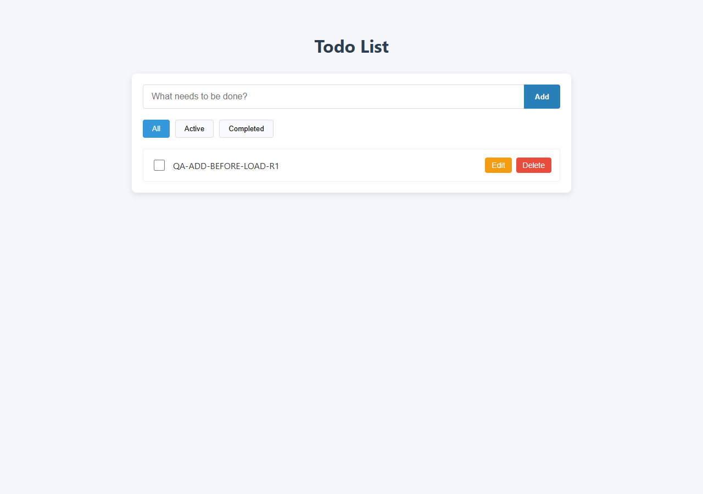
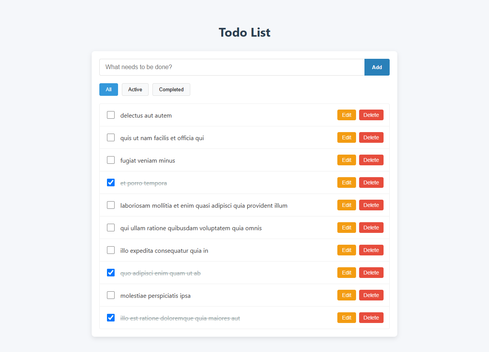

# Отчёт о тестировании `angular-todo-app`

**Дата:** 31.08–01.09.2026 · **Итог:** рекомендую отложить релиз до исправления BUG-001 и BUG-002

## 1. Коротко о результате

Обычные операции со списком работают, пока запросы выполняются последовательно. При задержке до двух секунд приложение может потерять уже созданную задачу или вернуть старый текст после повторного редактирования. Оба дефекта воспроизводятся стабильно и затрагивают основные действия пользователя.

Найдено два дефекта уровня Major. Особенности JSONPlaceholder — сброс после F5, фиктивная обработка изменений и повторяющийся ID новых задач — сами по себе багами приложения не считались.

### Окружение

| Параметр | Значение |
|---|---|
| ОС | Windows 11 Pro, 64-bit, build 26200 |
| Основной браузер | Google Chrome 152.0.7977.64, 1280×900 |
| Дополнительный smoke | Firefox 139; Playwright WebKit 18.5 — проверка движка, не полноценный Safari-тест |
| Node.js / npm | 18.20.8 / 10.8.2 |
| Angular | 16.2.12 |
| Стенд | `http://127.0.0.1:4201` |
| API | `https://jsonplaceholder.typicode.com/todos` |
| SHA-256 архива приложения | `03DF42B0B24F4BFF3C40FD868459A967EB2507570159EF737B12E9AD05DCBD2C` |

Финальный стенд развёрнут из чистой копии архива на Node 18.20.8. `npm ci` и production build завершились успешно. В Firefox и WebKit проверены загрузка, Add через Enter, Edit, completion, Delete и фильтры; ошибок JavaScript не зафиксировано. BUG-001 и BUG-002 дополнительно подтверждены в Chrome по 2/2 на этом стенде.

### Чистое время

| Этап | Время |
|---|---:|
| Развёртывание и проверка окружения | 00:20 |
| Исследовательская сессия | 00:50 |
| Повторное воспроизведение и сбор доказательств | 00:25 |
| Тест-план и тест-кейсы | 00:35 |
| Отчёт, повторная проверка окружения и финальный просмотр | 00:50 |
| **Всего** | **03:00** |

Паузы и ожидание загрузки инструментов в это время не включены. Исходный код приложения не изменялся.

## 2. Исследовательское тестирование

### Что проверено за 50 минут

| Время | Фокус | Результат |
|---|---|---|
| 10 мин | Загрузка, список, Add, Edit, completion, Delete, фильтры | Основной последовательный сценарий работает |
| 15 мин | Создание и фильтры при задержке до 2 с | Найден BUG-001: поздний GET удаляет новую задачу из списка |
| 15 мин | Повторное сохранение, удаление, ответы не по порядку | Найден BUG-002: поздний PUT возвращает старый текст |
| 10 мин | Ошибки сети, пустые и длинные значения, Unicode, состояние интерфейса | Критических ошибок не найдено; замечания оставлены как наблюдения |

### Ответы на вопросы задания

**1. Какие области наиболее важны для пользователя?**

1. Создание и сохранность задач. Потеря уже созданной задачи означает потерю пользовательских данных и подрывает доверие к приложению.
2. Редактирование и удаление выбранной задачи. Ошибка адресации может изменить не ту запись, а поздний ответ — отменить последнее действие пользователя.
3. Completion и фильтры. Если статус и выборки All/Active/Completed расходятся, пользователь видит недостоверный список выполненных дел.

**2. Что я бы оставил на последнюю очередь, если до релиза один час?**

Пиксельные отличия, оттенки, небольшие отступы и редкие размеры экрана. Сначала я бы проверил запуск хотя бы в одном браузере на другом движке, затем основной CRUD, задержку, повторные действия и обрыв сети. Эти проверки напрямую связаны с потерей данных и доступностью основного сценария.

**3. Какой неочевидный риск создаёт публичный API?**

Успешный ответ не обязательно отражает самое новое состояние интерфейса. Если запросы завершаются в другом порядке, поздний ответ может перезаписать более свежее действие пользователя. Отдельный риск — JSONPlaceholder возвращает один и тот же ID для нескольких POST. Семантика нескольких таких объектов не определена, поэтому это вынесено в ограничения интеграции, а не оформлено как дефект клиента.

### Ограничения и наблюдения

- JSONPlaceholder не сохраняет изменения. Исчезновение созданной задачи только после F5 — ожидаемое поведение тестового API.
- В проверенном окружении несколько POST возвращают `id: 201`. Пока не определено, должны ли такие ответы считаться разными локальными задачами, поведение Edit/Delete нельзя однозначно оценить как дефект клиента.
- PUT для новой задачи с ID 201 фактически возвращал 500, хотя в задании сказано, что PUT работает с любыми ID. Это расхождение окружения, а не баг приложения.
- Максимальная длина заголовка и правило обработки пробелов не заданы. Здесь проверялась сохранность текста и целостность интерфейса без придуманного лимита.

## 3. Мини тест-план: infinite scroll

**Цель:** проверить, что задачи подгружаются порциями по 15, а задержка, ошибка сети и локальные изменения не приводят к дублям или пропускам.

**В проверку входят:** `_page` и `_limit`; первая и последующие порции; повторный скролл во время запроса; индикатор загрузки; конец списка; 4xx/5xx и отсутствие сети; повтор запроса; Add/Edit/Delete/completion; фильтры; Chrome и короткий smoke на другом движке; Console и Network.

**Не входят:** нагрузочное и security-тестирование, внутренняя работа JSONPlaceholder, автоматизация и полная проверка доступности.

**Виды проверок:** smoke, функциональные, интеграционные клиент–API, негативные, восстановление после ошибки, состояние интерфейса, совместимость браузеров.

### Основные риски

| Риск | Как проверить | Приоритет |
|---|---|---:|
| Пользователь несколько раз достигает конца списка, пока ответ задержан на 2 с | Повторить скролл 10 раз; в Network должен появиться один GET текущей страницы | Critical |
| Ответы страниц приходят не по порядку | Задержать Page 2 на 2 с, Page 3 на 100 мс; сверить итоговый порядок и ID | Critical |
| На границе страниц появляются дубли или пропуски | Сверять число и ID элементов соседних порций | Critical |
| Add/Delete меняют длину локального массива | После локальной операции следующий запрос должен иметь `_page=N+1`, где N — последняя успешно загруженная серверная страница | High |
| Ошибка подгрузки очищает уже показанный список | Вернуть 500 или отключить сеть на Page N, затем повторить запрос | Critical |
| Клиент не распознаёт конец данных | Проверить короткую или пустую порцию и `X-Total-Count`, затем продолжить скролл | High |
| Фильтры считают только часть списка или меняют параметры пагинации | Проверить All/Active/Completed после каждой порции и изменения статуса | High |

### Definition of Done

1. Первый GET отправляется с `_page=1&_limit=15`; UI показывает число строк, полученное в ответе, но не больше 15.
2. Один переход к нижней границе создаёт один GET следующей страницы. Пока он не завершён, повторный скролл не создаёт новых GET.
3. После успешного ответа Page N следующий запрос содержит `_page=N+1`; номера страниц не повторяются и не пропускаются.
4. Каждый серверный ID отображается один раз; порядок строк соответствует порядку загруженных страниц.
5. Поздний ответ страницы не отменяет Add/Edit/Delete/completion, выполненные после начала этого запроса.
6. При 4xx, 5xx или отсутствии сети загруженные строки остаются на месте; пользователь видит ошибку, а Retry отправляет один GET той же страницы.
7. Конец списка определяется по `X-Total-Count` или неполной/пустой порции согласно согласованному контракту. После этого скролл не отправляет GET.
8. Локальные Add/Delete не используются для вычисления `_page`: следующая страница определяется по последней успешно загруженной серверной странице.
9. All показывает все загруженные строки, Active — только `completed=false`, Completed — только `completed=true`.
10. Нет открытых Blocker, Critical и Major, относящихся к изменению; результаты smoke и регресса CRUD зафиксированы.

## 4. Тест-кейсы

### A — создание задачи

**Общие предусловия:** исходный список загружен, выбран All, DevTools открыт на вкладке Network. Особые сетевые условия указаны в шагах конкретного кейса.

| ID / название | Шаги | Ожидаемый результат | P |
|---|---|---|---:|
| A-01 — Добавление кнопкой | Ввести `QA-A-01`, нажать Add, дождаться ответа | Отправлен один POST; после 201 задача показана в списке один раз; в Active стало на одну строку больше; поле очищено | High |
| A-02 — Добавление через Enter | Ввести `QA-A-02`, нажать Enter | Отправлен один POST; после 201 задача показана один раз; поле очищено | High |
| A-03 — Пустой заголовок | Попытаться отправить пустую строку, пробелы, NBSP и zero-width space | POST не отправлен; количество строк в All/Active/Completed не изменилось; визуально пустой задачи нет | Medium |
| A-04 — Unicode и спецсимволы | Создать `Привет-你好-😀-` | В запросе и строке сохранён исходный текст; код не выполняется | Medium |
| A-05 — Длинный заголовок | На ширине 1280 и 375 px создать заголовок из 1000 символов без пробелов | Текст не потерян; горизонтальной прокрутки страницы нет; Edit/Delete доступны | Low |
| A-06 — Повторная отправка | Задержать POST на 2 с; дважды нажать Add и затем Enter до ответа | Для одного ввода отправлен один POST; после 201 показана одна новая задача | Critical |
| A-07 — Ошибка создания | Во время POST отключить сеть; повторить с ответом 500; затем восстановить сеть | Ложной задачи нет; введённый текст сохранён; видны ошибка и возможность повторить действие | Critical |
| A-08 — Несколько задач подряд | Последовательно создать три задачи и записать ID из каждого ответа | Каждый успешный POST добавляет одну строку; все три заголовка показаны по одному разу; повторяющиеся ID отмечены как риск контракта | Medium |

### C — редактирование задачи

**Общие предусловия:** исходный список загружен, выбран All, для редактирования используются существующие задачи с известными ID. Особые сетевые условия указаны в шагах.

| ID / название | Шаги | Ожидаемый результат | P |
|---|---|---|---:|
| C-01 — Save кнопкой | Edit задачи ID 1 → `QA-C-01` → Save | Отправлен один PUT `/1`; после 200 изменён текст одной строки, `completed` не изменился | High |
| C-02 — Save через Enter | Edit задачи ID 2 → `QA-C-02` → Enter | Отправлен один PUT `/2`; после 200 новый текст показан в одной строке | High |
| C-03 — Пустой текст | Попытаться сохранить пустую строку, пробелы и zero-width space | PUT не отправлен; исходный текст остался; показана ошибка валидации | Medium |
| C-04 — Unicode и спецсимволы | Сохранить `Привет-你好-😀-<svg onload=alert(1)>` | PUT содержит исходную строку; текст показан без выполнения кода | Medium |
| C-05 — Длинный текст | На ширине 1280 и 375 px сохранить 1000 символов без пробелов | Текст не потерян; горизонтальной прокрутки страницы нет; действия доступны | Low |
| C-06 — Два сохранения подряд | Первый PUT задержать на 2 с с текстом `FIRST`; до ответа сохранить `SECOND` с задержкой 100 мс | После завершения обоих запросов в строке остаётся `SECOND` | Critical |
| C-07 — Ошибка сохранения | Во время PUT отключить сеть; повторить с ответом 500; затем восстановить сеть | Старый текст не выдан за сохранённый; введённое значение доступно для повторной отправки; показана ошибка | Critical |
| C-08 — Переход между задачами | Открыть Edit у ID 1, затем у ID 2; сохранить изменение только для ID 2 | Режим редактирования относится к выбранной строке; PUT отправлен для `/2`; ID 1 не изменён | High |

## 5. Баг-репорты

### BUG-001 — Новая задача исчезает после завершения исходного GET

| Поле | Значение |
|---|---|
| Окружение | Node 18.20.8; Chrome 152; Windows 11 |
| Предусловия / данные | GET `/todos?_limit=10` задержан на 2 с; POST без дополнительной задержки; `QA-ADD-BEFORE-LOAD-R1` |
| Шаги | Обновить страницу → до ответа GET ввести данные и нажать Add → дождаться POST 201 → дождаться GET 200 |
| Фактический результат | После POST задача видна. После GET она исчезает, список содержит только десять серверных задач |
| Ожидаемый результат | После завершения GET созданная задача остаётся в списке и отображается один раз |
| Severity / воспроизводимость | **Major**; Chrome 2/2 на финальном стенде Node 18 |
| Вложения | См. ниже: состояние после POST 201 и после позднего GET 200 |

### BUG-002 — Поздний ответ первого PUT возвращает старый текст задачи

| Поле | Значение |
|---|---|
| Окружение | Node 18.20.8; Chrome 152; Windows 11; задача ID 1 |
| Предусловия / данные | Первый PUT задержан на 2 с: `FIRST`; второй — на 100 мс: `SECOND` |
| Шаги | Сохранить `FIRST` → до ответа снова открыть Edit и сохранить `SECOND` → дождаться обоих ответов |
| Фактический результат | После второго ответа показан `SECOND`; после позднего первого ответа текст меняется на `FIRST` |
| Ожидаемый результат | После завершения обоих запросов в строке остаётся последнее сохранённое значение `SECOND` |
| Severity / воспроизводимость | **Major**; Chrome 2/2 на финальном стенде Node 18 |
| Вложения | См. ниже: состояние после второго PUT и после позднего первого PUT |

### Доказательства

<table class="evidence-grid">
  <tr>
    <th>BUG-001 — до: задача появилась после POST 201</th>
    <th>BUG-001 — после: поздний GET 200 удалил задачу из списка</th>
  </tr>
  <tr>
    <td></td>
    <td></td>
  </tr>
  <tr>
    <th>BUG-002 — до: после второго PUT показан SECOND</th>
    <th>BUG-002 — после: поздний первый PUT вернул FIRST</th>
  </tr>
  <tr>
    <td></td>
    <td></td>
  </tr>
</table>

## 6. Вывод

Приложение запускается и проходит базовый CRUD в Chrome, Firefox и WebKit. К релизу его пока не рекомендую: при разрешённой условиями задания задержке теряется результат создания и последнего редактирования. Повторяющийся ID JSONPlaceholder оставлен интеграционным риском до уточнения семантики нескольких POST.
