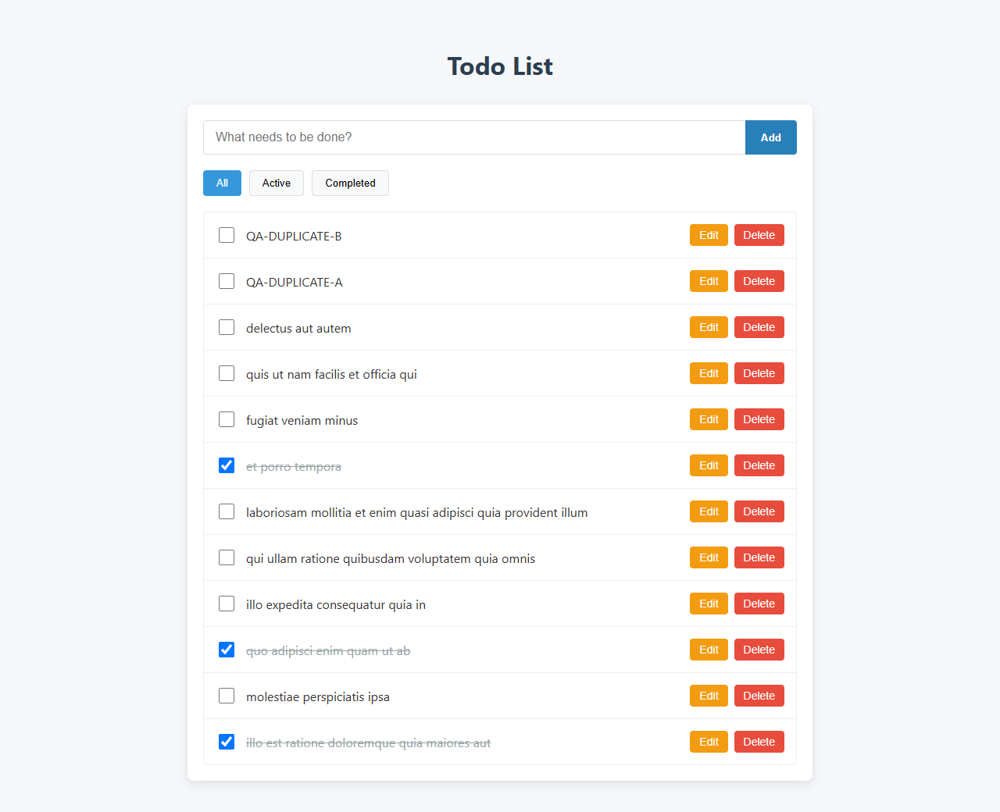
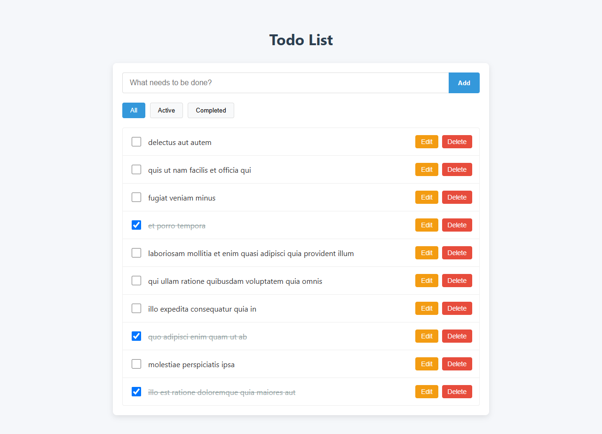

# Отчёт по тестированию `angular-todo-app`

**Роль:** Manual QA Engineer  
**Дата тестирования:** 31.08.2026  
**Планируемый срок сдачи:** текущая рабочая сессия  
**Статус:** условный **No-Go** до исправления трёх дефектов уровня Major

## 1. Краткая сводка

Базовые сценарии загрузки, создания, фильтрации, изменения статуса, редактирования и удаления работают при последовательных успешных ответах API. При допустимой задержке до 2 секунд обнаружены гонки, приводящие к потере пользовательских изменений. Также повторяющийся серверный ID новых задач нарушает адресность операций в локальном списке.

Итог исследовательской сессии:

- подтверждено 3 дефекта уровня **Major**;
- каждый дефект воспроизведён 2/2 в Chrome и дополнительно 1/1 в Edge;
- базовый smoke CRUD пройден;
- сброс данных после перезагрузки не классифицирован как дефект, поскольку это заявленное ограничение JSONPlaceholder;
- автоматизированный набор тестов не создавался; сетевые условия управлялись разово для воспроизводимости задержек и ошибок.

## 2. Окружение и затраченное время

| Параметр | Значение |
|---|---|
| ОС | Microsoft Windows 11 Pro, 64-bit, build 26200 |
| Основной браузер | Google Chrome 152.0.7977.64, viewport 1280×900 |
| Дополнительный smoke | Microsoft Edge 152.0.4191.53 |
| Node.js / npm | 24.14.0 / 11.9.0 |
| Приложение | Angular 16.2.12, `http://127.0.0.1:4200` |
| API | `https://jsonplaceholder.typicode.com/todos` |
| SHA-256 исходного архива | `03DF42B0B24F4BFF3C40FD868459A967EB2507570159EF737B12E9AD05DCBD2C` |

| Этап | Чистое время |
|---|---:|
| Развёртывание и проверка окружения | 00:05 |
| Исследовательское тестирование | 00:50 |
| Анализ, тест-дизайн и оформление | 00:20 |
| **Всего** | **01:15** |

Время округлено до пяти минут; пауза между частями исследовательской сессии в чистое время не включена.

## 3. Исследовательское тестирование

### 3.1. Выполненные чартеры

| Чартер | Основные проверки | Результат |
|---|---|---|
| Базовый пользовательский поток | Загрузка, Add/Enter, Edit/Enter, completion, Delete, All/Active/Completed | Smoke пройден; после создания: 11 задач, Active 8, Completed 3 |
| Создание и фильтрация | Пустые значения, пробелы, Unicode, спецсимволы, длинные строки, несколько задач, задержка POST, смена фильтра | XSS не выполняется, UTF-8 сохраняется; найдены переполнение длинным словом и конфликт повторных ID |
| Асинхронный CRUD | GET/POST/PUT/DELETE с задержками 100 мс–2 с, повторные действия, ответы не по порядку | Найдены BUG-001 и BUG-002; 5 быстрых Delete создают 5 запросов |
| Ошибки и восстановление | Offline, HTTP 500, начальная ошибка GET, повтор после восстановления сети | Нет видимого сообщения/retry; POST теряет введённый текст, failed PUT может оставить ложное локальное состояние |
| Границы и UI | Пустой набор, все Active/Completed, 320/375/1280 px, клавиатура, длинная строка | Фильтры считают верно; стандартный мобильный smoke пройден; длинное слово создаёт горизонтальный overflow |

При успешном последовательном CRUD фактические ответы составили: GET 200, POST 201, PUT 200, DELETE 200. Обычные измеренные времена находились примерно в диапазоне 138–652 мс.

### 3.2. Ответы на вопросы задания

#### 1. Какие три области наиболее критичны для пользователя?

1. **Согласованность списка при асинхронном CRUD.** Пользователь должен видеть результат последнего действия, независимо от порядка ответов. Потеря созданной задачи или откат последнего редактирования разрушает доверие к менеджеру задач.
2. **Адресность операций над новыми задачами.** Edit и Delete должны воздействовать ровно на выбранную запись. Повторяющиеся серверные ID не должны приводить к изменению или удалению соседних задач.
3. **Completion вместе с фильтрами.** Статус определяет, в какой выборке находится задача. Ошибка синхронизации одновременно искажает данные и видимое содержимое All/Active/Completed.

#### 2. Что отложить, если до релиза остался один час?

В последнюю очередь проверялись бы пиксельные отличия, оттенки, мелкие отступы, редкие viewport вне заявленной матрицы и расширенная кросс-браузерная проверка. Нагрузочное и security-тестирование прямо исключены заданием. Освободившееся время следует направить на CRUD, ошибки сети, повторные действия и порядок ответов API: они влияют на сохранность пользовательских данных.

#### 3. Какой неочевидный риск связан с JSONPlaceholder?

POST нескольких задач возвращает для каждой ID `201`. Если клиент использует серверный ID как уникальный локальный ключ, задачи становятся неразличимыми: один Edit переводит несколько строк в режим редактирования, один Delete удаляет несколько записей. Второй риск — поздний успешный ответ может перезаписать более новое локальное состояние, хотя каждый отдельный запрос завершился успешно.

### 3.3. Ограничения и уточнения окружения

- Изменения JSONPlaceholder не персистентны; исчезновение данных только после F5 не является багом.
- В текущем окружении POST возвращает ID `201`, DELETE `/201` — 200, а PUT `/201` — 500. Это расходится с утверждением задания о PUT для любого ID. Сам ответ внешнего API не оформлялся как дефект приложения; отдельно оценивалась реакция клиента.
- Политика обрезки пробелов, максимальная длина заголовка, поддерживаемые viewport и поведение фильтров после внедрения пагинации не заданы. Там, где ожидаемое поведение зависит от этих решений, это отмечено как требование для уточнения.
- `favicon.ico` возвращает 404, но не влияет на основную функцию и не вошёл в баг-репорты.

## 4. Мини тест-план: infinite scroll

### 4.1. Цель и контракт

Проверить, что приложение загружает задачи порциями по 15 без дублей, пропусков и потери локальных изменений, оставаясь управляемым при задержках и ошибках API.

Текущий контракт JSONPlaceholder проверен отдельно:

- страницы 1–13 возвращают по 15 элементов;
- страница 14 возвращает 5 элементов с ID 196–200;
- страница 15 возвращает пустой массив;
- заголовок `X-Total-Count` равен `200`, `Link` содержит навигацию между страницами.

До начала приёмки нужно согласовать: фильтруется весь серверный набор или только уже загруженные задачи; куда вставляется новая задача; влияет ли локальное добавление/удаление на номер следующей серверной страницы.

### 4.2. Scope

**Включено:**

- первая порция из 15 задач и последующие порции;
- параметры `_page`/`_limit`, порядок и уникальность ID;
- триггер в конце списка, блокировка повторного триггера, индикатор загрузки;
- последняя неполная страница и завершение списка;
- задержка до 2 секунд, offline, HTTP 4xx/5xx, retry;
- быстрый скролл и ответы страниц не по порядку;
- взаимодействие с Add/Edit/Delete/completion и All/Active/Completed;
- Chrome и один дополнительный Chromium-браузер, desktop и мобильный viewport;
- Console и Network на отсутствие необработанных ошибок и лишних запросов.

**Исключено:**

- нагрузочное и длительное performance-тестирование API;
- security-тестирование;
- внутренняя логика и доступность внешнего сервера вне проверки клиентского контракта;
- автоматизация и глубокая accessibility-сертификация.

### 4.3. Виды тестирования

Smoke, функциональное, интеграционное клиент–API, UI/state, негативное и recovery, исследовательское, регрессионное CRUD/фильтров, базовая совместимость браузеров и viewport.

### 4.4. Риски и покрытие

| Риск | Влияние | Проверка | Приоритет |
|---|---|---|---|
| Повторный триггер отправляет один и тот же запрос несколько раз | Дубли, лишний трафик | Многократный скролл во время 2-секундной загрузки; подсчёт запросов | Critical |
| Страницы отвечают не по порядку | Нарушение порядка, откат состояния | Page 2 задержать на 2 с, Page 3 — на 100 мс; проверить итоговую последовательность | Critical |
| Пропуск или дублирование задач на границе страниц | Неполный/искажённый список | Проверять ID, количество и пересечение каждой пары соседних страниц | Critical |
| Add/Delete меняют длину массива, используемую как offset | Пропуск следующей серверной записи | Выполнить CRUD на страницах 1–3 и проверить следующий запрос/набор | High |
| Ошибка страницы повреждает уже загруженный список | Потеря данных | 500/offline на Page N, затем retry; предыдущие страницы неизменны | Critical |
| Неверное завершение списка | Бесконечные запросы или недостающие 5 записей | Page 14 = 5, после неё новых запросов нет; итог 200 уникальных ID | High |
| Фильтр и пагинация имеют разный scope | Неверные результаты Active/Completed | Проверить согласованный контракт на каждой порции и после completion | High |
| Нет обратной связи при задержке | Повторные действия и гонки | Loader, disabled/guard, доступность прокрутки и retry | High |

### 4.5. Definition of Done

Фича готова к релизу, если одновременно выполнено следующее:

1. Первый успешный GET отображает ровно 15 задач.
2. Один вход в согласованную trigger-зону создаёт ровно один запрос следующей страницы.
3. Повторный скролл во время запроса не дублирует и не пропускает страницу.
4. После каждой порции количество и последовательность уникальных ID совпадают с объединением полученных страниц.
5. Ответы не по порядку не нарушают порядок и не перезаписывают более новое локальное состояние.
6. При 4xx/5xx/offline уже загруженные задачи сохраняются; пользователь видит ошибку и может повторить ту же страницу.
7. Страница 14 добавляет последние 5 задач; после достижения 200 элементов запрос страницы 15 не отправляется.
8. Add/Edit/Delete/completion не изменяют серверный курсор и воздействуют только на выбранную задачу.
9. All/Active/Completed соответствуют согласованному scope фильтра после каждой загрузки и mutation.
10. Нет открытых Blocker, Critical и Major; Minor либо исправлены, либо письменно приняты владельцем продукта.

## 5. Тест-кейсы

### Сценарий A — создание новой задачи

#### TC-A-01 — Создание кнопкой Add

- **Предусловие:** исходный GET завершён, выбран All, сеть доступна.
- **Шаги:** ввести `QA-A-VALID-01`; нажать Add; дождаться POST.
- **Ожидаемый результат:** отправлен один POST; ответ 201 содержит числовой ID; задача отображается один раз как Active; введённый текст совпадает с отправленным; поле очищено после успеха.
- **Приоритет:** High.

#### TC-A-02 — Создание клавишей Enter

- **Предусловие:** исходный GET завершён, фокус в поле ввода.
- **Шаги:** ввести `QA-A-ENTER-01`; нажать Enter.
- **Ожидаемый результат:** поведение идентично TC-A-01; отправлен один POST, задача добавлена один раз, поле очищено.
- **Приоритет:** Medium.

#### TC-A-03 — Пустые и пробельные значения

- **Предусловие:** зафиксированы количество задач и запросов.
- **Шаги:** последовательно отправить пустую строку, обычные пробелы, NBSP и zero-width space.
- **Ожидаемый результат:** ни один визуально пустой вариант не создаёт задачу и не отправляет POST; количество задач не меняется.
- **Приоритет:** High.

#### TC-A-04 — Unicode и HTML-подобный текст

- **Предусловие:** исходный GET завершён.
- **Шаги:** создать задачу `Привет-你好-😀-`.
- **Ожидаемый результат:** строка без потерь передана в POST и показана как текст; HTML-элементы и диалоги не создаются; задача добавлена один раз.
- **Приоритет:** Medium.

#### TC-A-05 — Длинное слово без пробелов

- **Предусловие:** максимальная длина требованиями не ограничена; viewport 1280 и 375 px.
- **Шаги:** создать заголовок из 1000 символов без пробелов; проверить список и горизонтальную прокрутку.
- **Ожидаемый результат:** принятое значение сохраняется полностью и переносится/обрезается в границах строки; страница не получает горизонтальный overflow, действия остаются доступны.
- **Приоритет:** Low.

#### TC-A-06 — Задержка POST и повторная отправка

- **Предусловие:** POST задержан на 2 секунды.
- **Шаги:** отправить `QA-A-DELAY`; до ответа повторно нажать Add и Enter.
- **Ожидаемый результат:** для одного значения отправлен ровно один POST; есть индикатор/guard от дубля; после 201 задача отображается один раз.
- **Приоритет:** Critical.

#### TC-A-07 — Ошибка POST или offline

- **Предусловие:** список загружен; POST отвечает 500 либо сеть отключена.
- **Шаги:** ввести `QA-A-RETRY`; нажать Add; дождаться ошибки; восстановить сеть и повторить.
- **Ожидаемый результат:** ложная задача не появляется; введённый текст сохранён; показано сообщение и действие Retry; после успешного повтора задача появляется один раз.
- **Приоритет:** Critical.

#### TC-A-08 — Несколько созданий и уникальность локальной идентичности

- **Предусловие:** исходный GET завершён.
- **Шаги:** создать `QA-A-ID-1`, `QA-A-ID-2`, `QA-A-ID-3`; отредактировать и удалить только вторую.
- **Ожидаемый результат:** три строки различимы локально даже при одинаковом серверном ID; Edit/Delete затрагивают только `QA-A-ID-2`; остальные значения не меняются.
- **Приоритет:** Critical.

### Сценарий C — редактирование существующей задачи

#### TC-C-01 — Сохранение кнопкой Save

- **Предусловие:** существует задача ID 1; сеть доступна.
- **Шаги:** нажать Edit; заменить текст на `QA-C-SAVE-01`; нажать Save.
- **Ожидаемый результат:** отправлен один PUT для ID 1; после 200 в строке отображается новый текст; completion не изменён.
- **Приоритет:** High.

#### TC-C-02 — Сохранение клавишей Enter

- **Предусловие:** открыта другая существующая задача.
- **Шаги:** заменить текст на `QA-C-ENTER-01`; нажать Enter.
- **Ожидаемый результат:** результат идентичен TC-C-01; один PUT, новый текст отображается после успеха.
- **Приоритет:** Medium.

#### TC-C-03 — Пустой и пробельный текст

- **Предусловие:** открыта задача с непустым заголовком.
- **Шаги:** попытаться сохранить пустую строку, пробелы и zero-width space.
- **Ожидаемый результат:** PUT не отправляется; исходный текст сохранён; пользователь видит однозначную ошибку валидации.
- **Приоритет:** High.

#### TC-C-04 — Unicode и HTML-подобный текст

- **Предусловие:** открыта существующая задача.
- **Шаги:** сохранить `Привет-你好-😀-<svg onload=alert(1)>`.
- **Ожидаемый результат:** строка передана и отображена без потерь как текст; код не выполняется; остальные поля задачи сохранены.
- **Приоритет:** Medium.

#### TC-C-05 — Длинный текст

- **Предусловие:** лимит длины не задан; viewport 1280 и 375 px.
- **Шаги:** сохранить 1000 символов без пробелов; проверить строку и действия.
- **Ожидаемый результат:** принятое значение не обрезано и не ломает ширину страницы; Edit/Delete остаются доступны.
- **Приоритет:** Low.

#### TC-C-06 — Два сохранения и ответы не по порядку

- **Предусловие:** первый PUT задержан на 2 секунды, второй — на 100 мс.
- **Шаги:** сохранить `FIRST`; до ответа снова открыть Edit и сохранить `SECOND`; дождаться обоих ответов.
- **Ожидаемый результат:** итоговый текст `SECOND`; поздний ответ `FIRST` игнорируется либо повторное редактирование заблокировано до завершения первого PUT.
- **Приоритет:** Critical.

#### TC-C-07 — Ошибка PUT или offline

- **Предусловие:** PUT отвечает 500 либо сеть отключена.
- **Шаги:** изменить текст на `QA-C-RETRY`; нажать Save; дождаться ошибки; восстановить сеть и повторить.
- **Ожидаемый результат:** старое серверное значение не выдаётся за успешно сохранённое; введённый текст остаётся доступен; показаны ошибка и Retry; после успеха обновлена ровно выбранная задача.
- **Приоритет:** Critical.

#### TC-C-08 — Редактирование одной из нескольких новых задач

- **Предусловие:** созданы `QA-C-ID-1` и `QA-C-ID-2`; API мог вернуть одинаковые ID.
- **Шаги:** нажать Edit у второй задачи; сохранить новый текст.
- **Ожидаемый результат:** режим редактирования открыт только во второй строке; PUT/локальное обновление относится только к ней; первая задача не меняется.
- **Приоритет:** Critical.

## 6. Баг-репорты

### BUG-001 — Новая задача исчезает после завершения исходного GET, если создать её во время загрузки

- **Окружение:** Chrome 152.0.7977.64; Windows 11; `http://127.0.0.1:4200`.
- **Предусловие:** cache отключён; GET `/todos?_limit=10` задержан на 2000 мс; POST работает без дополнительной задержки.
- **Тестовые данные:** `QA-ADD-BEFORE-LOAD-R1`.
- **Шаги воспроизведения:**
  1. Перезагрузить приложение.
  2. До завершения исходного GET ввести тестовый заголовок и нажать Add.
  3. Дождаться POST 201 и убедиться, что новая задача появилась.
  4. Дождаться исходного GET 200.
- **Фактический результат:** после POST видна одна новая задача; после GET она исчезает, а список заменяется десятью серверными задачами.
- **Ожидаемый результат:** успешная новая задача остаётся в списке после завершения GET; данные объединяются без потерь либо Add заблокирован до окончания начальной загрузки.
- **Серьёзность:** **Major** — успешное пользовательское создание теряется в рамках одной сессии.
- **Воспроизводимость:** Chrome 2/2; Edge 1/1.

После POST 201:

После позднего GET 200:

### BUG-002 — Поздний ответ первого PUT перезаписывает второе, более новое редактирование

- **Окружение:** Chrome 152.0.7977.64; Windows 11.
- **Предусловие:** существующая задача ID 1; первый PUT задержан на 2000 мс, второй — на 100 мс.
- **Тестовые данные:** `QA-FIRST-SAVE-R1`, затем `QA-SECOND-SAVE-R1`.
- **Шаги воспроизведения:**
  1. Открыть Edit первой задачи, ввести `QA-FIRST-SAVE-R1`, нажать Save.
  2. Не дожидаясь ответа, снова открыть Edit той же задачи.
  3. Ввести `QA-SECOND-SAVE-R1`, нажать Save.
  4. Дождаться сначала второго, затем первого ответа.
- **Фактический результат:** после второго ответа отображается `QA-SECOND-SAVE-R1`; после позднего первого ответа текст откатывается к `QA-FIRST-SAVE-R1`.
- **Ожидаемый результат:** итоговое состояние соответствует последнему действию — `QA-SECOND-SAVE-R1`; устаревший ответ не применён либо повторный Edit заблокирован.
- **Серьёзность:** **Major** — подтверждённое успешное последнее изменение теряется.
- **Воспроизводимость:** Chrome 2/2; Edge 1/1.

После ответа второго PUT:

После позднего ответа первого PUT:

### BUG-003 — Delete одной новой задачи удаляет все новые задачи с повторяющимся ID 201

- **Окружение:** Chrome 152.0.7977.64; Windows 11; реальный JSONPlaceholder без подмены ответов.
- **Предусловие:** исходный список загружен.
- **Тестовые данные:** `QA-DUPLICATE-A`, `QA-DUPLICATE-B`.
- **Шаги воспроизведения:**
  1. Создать `QA-DUPLICATE-A` и дождаться POST 201.
  2. Создать `QA-DUPLICATE-B` и дождаться POST 201.
  3. Убедиться, что обе задачи показаны; оба ответа содержат ID 201.
  4. Нажать Delete только у `QA-DUPLICATE-B` и дождаться DELETE `/201` 200.
- **Фактический результат:** обе новые задачи исчезают; количество строк меняется с 12 на 10. Дополнительно Edit одной из них открывает редакторы сразу в обеих строках.
- **Ожидаемый результат:** исчезает только `QA-DUPLICATE-B`; остаётся 11 строк; Edit/Delete адресуют выбранный локальный объект независимо от повторного серверного ID.
- **Серьёзность:** **Major** — одно действие удаляет несколько пользовательских записей.
- **Воспроизводимость:** Chrome 2/2 и дополнительный прогон с тремя задачами; Edge 1/1.

До Delete:

После одного Delete:

Связанное проявление — два редактора после одного Edit:

## 7. Вывод

Приложение подходит для последовательного happy path, но не обеспечивает сохранность последнего пользовательского состояния при заявленной сетевой задержке и особенностях JSONPlaceholder. Перед релизом необходимо исключить замену локального массива поздним GET, ввести управление конкурентными mutation-запросами и отделить локальную идентичность задачи от повторяющегося серверного ID.
